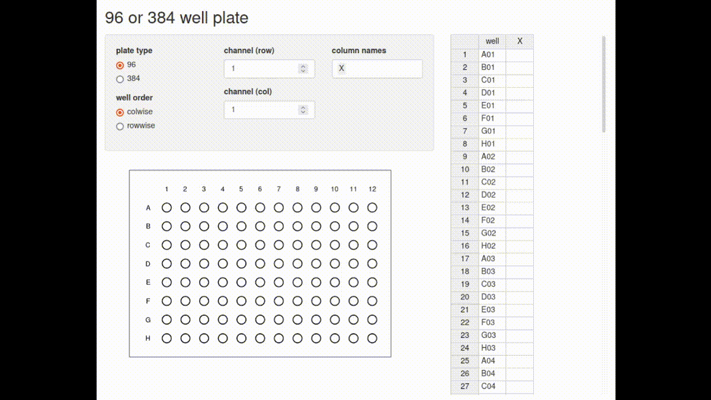

# Shiny Wellplate

This is an example app to show how to build wellplate like interface using basic shiny functions and a little javascript code.
If you want to try it now, click the link below.

https://sabe.shinyapps.io/shinywellplate/

## Reference 

* https://shiny.rstudio.com/articles/plot-interaction.html
* https://jokergoo.github.io/2021/02/20/differentiate-brush-and-click-event-in-shiny/

